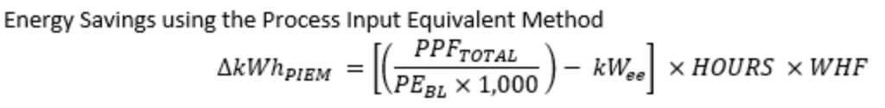
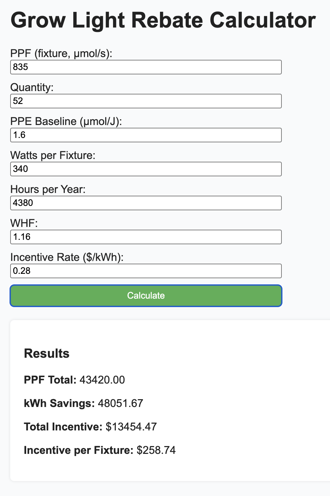

# Grow Light Rebate Calculator

A full-stack web application that estimates energy savings and incentives for grow light installations. Users can input fixture and energy details to calculate kWh savings and incentive amounts.

---

## Features

- **Rebate calculation uses the process input equivalent method (PIEM)** to provide accurate energy savings and incentives. 
 
- Client-server architecture: frontend hosted on GitHub Pages, backend hosted on Render.   

---

## Tech Stack

- **Frontend:** HTML, CSS, JavaScript  
- **Backend:** Node.js, Express  
- **Deployment:** GitHub Pages (frontend), Render (backend)

---

## Live Demo

- **Frontend:** [GitHub Pages](https://thomas-kiss.github.io/rebate_estimator/)  
- **Backend API:** [Render](https://rebate-estimator.onrender.com)

---

## Usage

1. Open the calculator in your browser.  
2. Enter all required values in the form:
   - PPF per fixture
   - Quantity of fixtures
   - PPE baseline
   - Watts per fixture
   - Hours per year
   - Waste heat factor (WHF)
   - Incentive rate ($/kWh)  
3. Click **Calculate** to see results for total PPF, annual kWh savings, total incentive, and incentive per fixture.

---

## Screenshot

---

## Repository Links

- **GitHub Repo:** [https://github.com/thomas-kiss/rebate_estimator](https://github.com/thomas-kiss/rebate_estimator)  
- **Live Demo:** [https://thomas-kiss.github.io/rebate_estimator/](https://thomas-kiss.github.io/rebate_estimator/)
